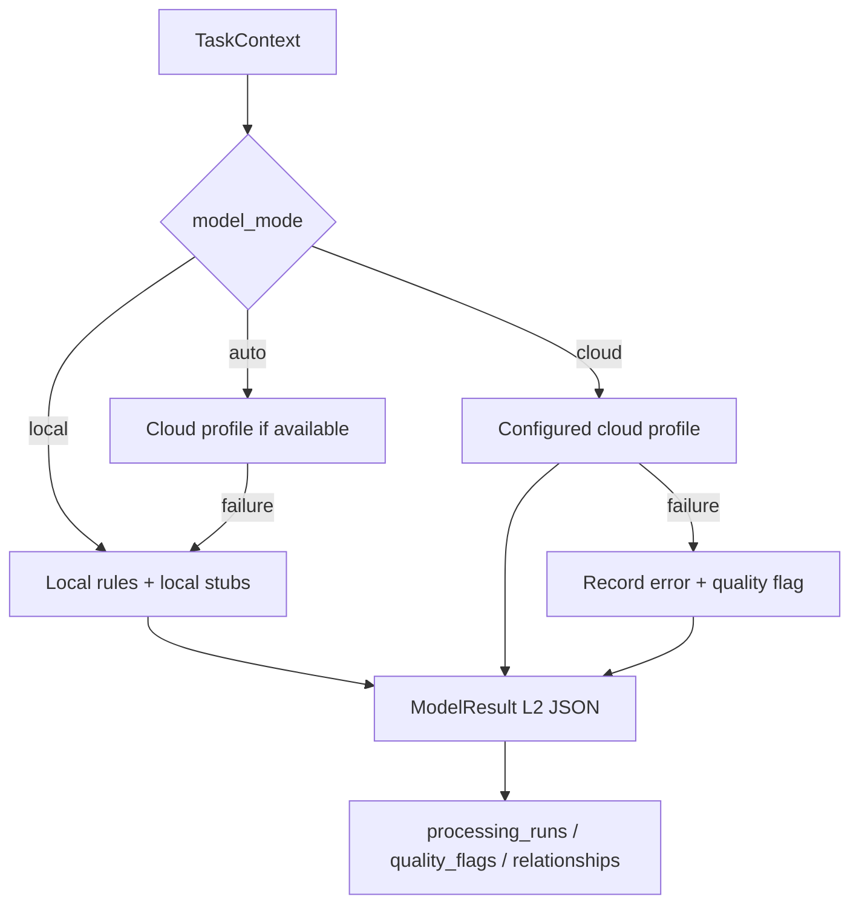

# Opencode / DeepSeek Implementation Plan: Configurable Model Service Layer

## 1. Objective

Implement a configurable model service layer for the existing Material R&D Data Processing Agent.

The system should allow users to configure multiple model roles, route tasks to the right role, fallback safely when models are unavailable, and write all model outputs into the existing evidence package:

- `processing_runs`
- `quality_flags`
- `relationships`
- `derived/*.json`
- `manifest.json`

This iteration must keep the current rule-based MVP stable. Model services are controlled tools, not a new agent framework.

## 2. Hard Boundaries

Do not do these in this iteration:

- Do not introduce LangChain, CrewAI, pi-go, Craft Agents, or any general agent framework.
- Do not rewrite `ingest`, `process`, `review`, or evidence package architecture.
- Do not build a frontend.
- Do not implement PaddleOCR.
- Do not implement chart digitization.
- Do not generate scientific conclusions, mechanism explanations, or experiment recommendations.
- Do not change SQLite table structure.
- Do not write database migrations.
- Do not store real API keys in repository files.

Allowed:

- Add `DataType.MODEL_RESULT = "model_result"` enum.
- Continue using existing SQLite TEXT fields.
- Only guarantee new workspace validation.

## 3. Key Design Decisions

- Keep existing CLI behavior:
  - `data_agent process --models local`
  - `data_agent process --models cloud`
  - `data_agent process --models auto`
- Keep default model mode as `local`.
- Use `requests` for OpenAI-compatible HTTP calls in this iteration.
- Use `PyYAML` for model profile loading.
- Keep raw numeric, raw spectral, and sample metadata model-free by default in all modes.
- Keep existing processor return contract as much as possible:
  - `run, derived_objects, flags`
- If multiple model runs are required, add a backward-compatible wrapper. Do not break existing processors.
- `local` mode must never call cloud providers or make network requests.
- `auto` mode may try configured cloud profiles, then fallback to local stubs.
- `cloud` mode may fail model calls, but the main processing workflow must not crash.

## 4. Files To Add Or Modify

Use paths relative to repository root.

Add:

- `OPENCODE_PLAN.md`
- `.env.example`
- `model_profiles.yaml.example`
- `docs/model_service_layer.md`
- `MODEL_LAYER_CHECK.md`
- `data_agent/model_adapters/profiles.py`
- `data_agent/model_adapters/router.py`
- `data_agent/model_adapters/openai_compatible.py`
- `data_agent/model_adapters/stubs.py`
- `data_agent/model_adapters/redaction.py`
- `data_agent/model_adapters/prompts.py`
- `tests/test_model_profiles.py`
- `tests/test_model_router.py`
- `tests/test_model_provider_mock.py`
- `tests/test_model_evidence.py`

Modify:

- `.gitignore`
- `pyproject.toml`
- `README.md`
- `data_agent/schemas.py`
- `data_agent/model_adapters/base.py`
- `data_agent/model_adapters/__init__.py`
- `data_agent/process.py`
- `data_agent/processors/chart_image.py`
- `data_agent/processors/visual_image.py`
- `data_agent/processors/observation_text.py`
- `data_agent/cli.py`

Avoid changing unless absolutely necessary:

- `data_agent/processors/numeric.py`
- `data_agent/processors/spectral.py`
- `data_agent/processors/metadata.py`
- `data_agent/ingest.py`
- `data_agent/reviews.py`

## 5. Configuration Files

### 5.1 `.gitignore`

Add:

```text
.env
```

### 5.2 `pyproject.toml`

Add dependencies:

```toml
"PyYAML>=6.0",
"requests>=2.31",
```

### 5.3 `.env.example`

Create:

```text
BEST_MODEL_BASE_URL=
BEST_MODEL_API_KEY=
BEST_MODEL_NAME=

FAST_MODEL_BASE_URL=
FAST_MODEL_API_KEY=
FAST_MODEL_NAME=

VISION_MODEL_BASE_URL=
VISION_MODEL_API_KEY=
VISION_MODEL_NAME=

OCR_MODEL_BASE_URL=
OCR_MODEL_API_KEY=
OCR_MODEL_NAME=
```

### 5.4 `model_profiles.yaml.example`

Create:

```yaml
profiles:
  fast:
    role: fast
    provider: openai_compatible
    base_url_env: FAST_MODEL_BASE_URL
    api_key_env: FAST_MODEL_API_KEY
    model_env: FAST_MODEL_NAME
    enabled: true
    priority: 10
    fallback: ["local_stub"]
    timeout_seconds: 45
    cost_tier: low
    supports_vision: false
    supports_json: true

  best:
    role: best
    provider: openai_compatible
    base_url_env: BEST_MODEL_BASE_URL
    api_key_env: BEST_MODEL_API_KEY
    model_env: BEST_MODEL_NAME
    enabled: true
    priority: 10
    fallback: ["fast", "local_stub"]
    timeout_seconds: 90
    cost_tier: high
    supports_vision: false
    supports_json: true

  vision:
    role: vision
    provider: openai_compatible_vision
    base_url_env: VISION_MODEL_BASE_URL
    api_key_env: VISION_MODEL_API_KEY
    model_env: VISION_MODEL_NAME
    enabled: true
    priority: 10
    fallback: ["local_stub"]
    timeout_seconds: 90
    cost_tier: medium
    supports_vision: true
    supports_json: true

  ocr:
    role: ocr
    provider: openai_compatible_vision
    base_url_env: OCR_MODEL_BASE_URL
    api_key_env: OCR_MODEL_API_KEY
    model_env: OCR_MODEL_NAME
    enabled: true
    priority: 10
    fallback: ["local_ocr_stub", "local_stub"]
    timeout_seconds: 60
    cost_tier: medium
    supports_vision: true
    supports_json: true
```

Rules:

- Never put real API keys in `model_profiles.yaml`.
- Store only env var names.
- If `model_profiles.yaml` is missing, local workflow must still pass.

## 6. Core Schemas And Classes

### 6.1 `data_agent/schemas.py`

Add:

```python
class DataType(str, Enum):
    ...
    MODEL_RESULT = "model_result"
```

Do not modify SQLite schema.

### 6.2 `data_agent/model_adapters/base.py`

Replace or extend the current minimal `ModelResult` while preserving compatibility where possible.

Recommended Pydantic models:

```python
from __future__ import annotations

from datetime import datetime, timezone
from typing import Any

from pydantic import BaseModel, Field


class ModelProfile(BaseModel):
    name: str
    role: str
    provider: str
    base_url_env: str = ""
    api_key_env: str = ""
    model_env: str = ""
    enabled: bool = True
    priority: int = 100
    fallback: list[str] = Field(default_factory=list)
    timeout_seconds: int = 60
    cost_tier: str = "medium"
    supports_vision: bool = False
    supports_json: bool = True


class TaskContext(BaseModel):
    task_id: str
    data_type: str
    subtype: str = ""
    file_ext: str = ""
    file_size_bytes: int = 0
    has_image: bool = False
    has_text: bool = False
    model_mode: str = "local"
    priority: str = "quality"
    needs_vision: bool = False
    user_requested_quality: str = ""
    enabled_escalation: bool = False


class ModelResult(BaseModel):
    success: bool
    role: str
    provider: str
    model: str = ""
    mode: str = "local"
    input_type: str = ""
    output_json: dict[str, Any] = Field(default_factory=dict)
    raw_text: str = ""
    raw_response: dict[str, Any] = Field(default_factory=dict)
    confidence: float = 0.0
    warnings: list[str] = Field(default_factory=list)
    error: str = ""
    fallback_used: bool = False
    fallback_from: str = ""
    latency_ms: int = 0
    token_usage: dict[str, Any] = Field(default_factory=dict)
    created_at: str = Field(default_factory=lambda: datetime.now(timezone.utc).isoformat())
    schema_version: str = "model_result_v1"
    prompt_version: str = ""
```

The existing `ChartImageAnalyzer` can remain temporarily if needed, but new processor code should use the router/provider path.

## 7. Redaction And Safety

Implement `data_agent/model_adapters/redaction.py`.

Requirements:

- API keys must never appear in:
  - SQLite
  - `derived/*.json`
  - `logs/*.json`
  - `logs/processing_report.md`
  - CLI output
  - test snapshots
  - error messages
- Do not persist request headers.
- Do not persist Authorization values.
- Do not persist complete request bodies if they contain sensitive values.
- If saving `raw_response`, save only redacted response body.
- Redact Bearer tokens and configured env var values.

Also enforce model output boundaries:

Forbidden output keys:

```text
final_conclusion
mechanism_explanation
experiment_recommendation
```

If a model returns these, remove them from persisted `output_json` and create a quality flag:

```text
model_output_excluded_from_conclusion
```

## 8. Provider Implementation

### 8.1 `openai_compatible`

File:

- `data_agent/model_adapters/openai_compatible.py`

Behavior:

- POST to `{base_url}/chat/completions`.
- Use `requests`.
- Send a JSON-only prompt.
- Parse assistant content as JSON.
- Convert provider response into `ModelResult`.
- Never return raw provider response directly to processors.
- On timeout, HTTP error, invalid JSON, or schema failure, return `success=false` `ModelResult`.

### 8.2 `openai_compatible_vision`

Same file or separate class.

Behavior:

- Accept image path.
- Encode image as base64 data URL.
- Send multimodal message.
- Parse JSON content.
- Convert to `ModelResult`.

### 8.3 `stubs.py`

Implement:

- `local_stub`
- `local_ocr_stub`

Behavior:

- Return structured `ModelResult`.
- `local_ocr_stub` should indicate:
  - `ocr_unavailable`
  - `requires_review=true`
- Stubs must not pretend OCR or vision succeeded.

## 9. Prompts And Output Shapes

File:

- `data_agent/model_adapters/prompts.py`

Prompt versions:

- `chart_image_ocr_v1`
- `chart_image_vision_v1`
- `visual_image_v1`
- `observation_text_v1`

All prompts must say:

- Output JSON only.
- Only report visible observations, metadata, uncertainty, and review needs.
- Do not produce scientific conclusions.
- Do not produce mechanism explanations.
- Do not produce experiment recommendations.
- Do not invent invisible information.
- If uncertain, set `requires_review=true`.

Expected `chart_image_input` fields:

```text
image_kind
chart_type
title
x_axis_label
y_axis_label
detected_units
legend_text
visible_series_count
visible_peak_candidates
text_blocks
uncertainties
requires_review
confidence
```

Expected `visual_image` fields:

```text
image_kind
detected_objects
visible_features
scale_bar_text
annotation_text
possible_measurement_targets
uncertainties
requires_review
confidence
```

Expected `descriptive_observation_text` fields:

```text
factual_observations
trend_or_statements
interpretation_candidates
operator_notes
sample_ids
time_expressions
phenomenon_types
requires_review
confidence
```

## 10. Router Rules

File:

- `data_agent/model_adapters/router.py`

Routing table:

```text
sample_metadata: no model
raw_numeric: no model
raw_spectral: no model
chart_image_input: ocr + vision
visual_image: vision + ocr
descriptive_observation_text: fast
structured_observation: no model
```

Mode behavior:

```text
local:
  Do not call cloud models.
  Use local rules and local stubs only.

cloud:
  Try configured cloud profile.
  Record errors and quality flags on failure.
  Do not crash the main workflow.

auto:
  Prefer configured cloud profile.
  Fallback on missing profile, missing env, timeout, invalid JSON, or schema failure.
  Record fallback_used.
```

Fallback chains:

```text
ocr -> local_ocr_stub -> local_stub
vision -> local_stub
fast -> local_stub
best -> fast -> local_stub
```

`auto` mode must write the actual profile/provider/model used into `ProcessingRun.parameters`.

## 11. Processor Integration

Modify carefully:

- `data_agent/process.py`
- `data_agent/processors/chart_image.py`
- `data_agent/processors/visual_image.py`
- `data_agent/processors/observation_text.py`

Important compatibility rule:

- Keep old processor return shape working:

```python
run, derived_objects, flags
```

If additional model runs are needed, either:

- Append them through a backward-compatible `ProcessorResult`, or
- Let processor return a structure that `process.py` normalizes while still accepting old tuples.

Do not break existing numeric/spectral/metadata tests.

### 11.1 Chart Image

`local`:

- Keep local image metadata.
- Keep filename-based axis inference.
- Create stub/fallback model result if useful.
- Add quality flags.
- Do not fake OCR or vision success.

`cloud` / `auto`:

- Call OCR role.
- Call vision role.
- Write:
  - `run_<short>__model_result_ocr.json`
  - `run_<short>__model_result_vision.json`
  - existing/final `chart_metadata.json`
- No curve digitization.
- No peak area.
- No material mechanism explanation.

### 11.2 Visual Image

`local`:

- Keep metadata extraction.
- Add manual review flag.
- Stub model result may be written as unavailable/low confidence.

`cloud` / `auto`:

- Call vision role.
- Call OCR role.
- Output visible features, annotation text, scale bar text, uncertainty, requires_review.
- Do not output particle size statistics.
- Do not output SEM final morphology conclusion.
- Do not output material performance judgment.

### 11.3 Observation Text

`local`:

- Keep current rule-based sentence split.

`cloud` / `auto`:

- Run local rules first.
- Then call `fast` model for structured enhancement.
- Keep interpretation candidates outside conclusions.

`best`:

- Only use when `enabled_escalation=true` or explicit parameter exists.
- Do not implement fragile automatic low-confidence escalation in this iteration.

## 12. Evidence Package Requirements

Each model call must create:

- A derived L2 JSON file:

```text
derived/run_<short>__model_result_<role>.json
```

- A `DataObject`:

```text
data_type = DataType.MODEL_RESULT
lifecycle = LifecycleLevel.L2
```

- A `ProcessingRun`:

```text
tool_name = "model:<role>"
```

- A relationship:

```text
L1 input data object -> model_result L2
```

If a model result is used by a final L2 output, also create:

```text
model_result L2 -> final L2
```

Manifest requirements:

- `manifest.derived_files` includes model result JSON.
- `manifest.object_ids` includes model result object IDs.
- `manifest.run_ids` includes model run IDs.
- `manifest.flag_ids` includes generated quality flags.

Rerun requirements:

- Old L2 files are preserved.
- New L2 files have run prefix.
- Replacement relationships still exist.
- Model result L2 participates in replacement relationships when same subtype is rerun.

## 13. Quality Flag Message Codes

Use these message codes consistently:

```text
model_unavailable
fallback_used
low_confidence_model_output
model_json_invalid
schema_validation_failed
ocr_unavailable
axis_confirmation_required
image_observation_requires_review
interpretation_candidate_detected
model_output_excluded_from_conclusion
requires_human_review
```

Keep existing flags when possible. Add codes inside message/evidence without breaking current tests.

## 14. CLI

Modify:

- `data_agent/cli.py`

Keep:

```bash
python3 -m data_agent process --workspace <workspace> --all --models local
python3 -m data_agent process --workspace <workspace> --all --models cloud
python3 -m data_agent process --workspace <workspace> --all --models auto
```

Add:

```bash
python3 -m data_agent models check --workspace <workspace>
python3 -m data_agent models check --workspace <workspace> --verbose
```

`models check` behavior:

- Check whether `model_profiles.yaml` exists.
- Check enabled profiles.
- Check whether env vars are configured.
- Show only `configured` or `missing` for API keys.
- Never print API key values.
- Default does not ping network.
- `--verbose` may list profile names, roles, providers, and env var names, but not values.

## 15. Documentation

Update:

- `README.md`

Add:

- Model service configuration.
- `local` / `cloud` / `auto` behavior.
- `.env.example` usage.
- OpenAI-compatible endpoint examples for users in mainland China.
- No-key fallback behavior.
- Warning not to commit real API keys.

Create:

- `docs/model_service_layer.md`
- `MODEL_LAYER_CHECK.md`

`docs/model_service_layer.md` must include:

- Model roles.
- Provider types.
- Router rules.
- OCR role design.
- ModelResult schema.
- Quality flag behavior.
- Safety and redaction rules.
- Mermaid routing diagram.

Mermaid starter:



`MODEL_LAYER_CHECK.md` must include:

- No-key local validation.
- No-key auto fallback validation.
- Optional with-key cloud validation template.
- Evidence package paths.
- API key non-persistence check.

## 16. Tests

Add tests before or alongside implementation. Use mocks for providers. Do not rely on real API calls in automated tests.

### 16.1 `tests/test_model_profiles.py`

Cover:

- Missing `model_profiles.yaml` still allows local workflow.
- Missing env marks profile unavailable.
- Env configured is detected.
- `models check --verbose` does not print key value.

### 16.2 `tests/test_model_router.py`

Cover:

- `raw_numeric` does not route to models in local/cloud/auto.
- `raw_spectral` does not route to models in local/cloud/auto.
- `sample_metadata` does not route to models in local/cloud/auto.
- `chart_image_input` routes to OCR + vision.
- `visual_image` routes to vision + OCR.
- `descriptive_observation_text` routes to fast in non-local modes.
- `auto` without key falls back to local stubs.

### 16.3 `tests/test_model_provider_mock.py`

Cover:

- Mock text provider success with valid JSON.
- Mock vision provider success with valid JSON.
- Mock invalid JSON.
- Mock timeout.
- Mock HTTP error.
- API key does not appear in `ModelResult`.

### 16.4 `tests/test_model_evidence.py`

Cover:

- `process --models local` makes no real provider/network calls.
- `process --models auto` without key does not crash.
- Model result L2 has relationship from original L1 data object.
- Model result JSON does not contain:
  - `final_conclusion`
  - `mechanism_explanation`
  - `experiment_recommendation`
- `.env` key does not appear in JSON, SQLite, or Markdown report.
- Rerun preserves old L2 and creates replacement relationships for model result outputs where applicable.

## 17. Required Validation Commands

Run existing tests:

```bash
python3 -m pytest -q
```

No-key demo workflow:

```bash
python3 -m data_agent ingest \
  --inbox "<demo>/inbox" \
  --workspace work/model-check

python3 -m data_agent process \
  --workspace work/model-check \
  --all \
  --models local

python3 -m data_agent process \
  --workspace work/model-check \
  --all \
  --models auto

python3 -m data_agent models check \
  --workspace work/model-check \
  --verbose
```

Optional with-key manual validation:

```bash
python3 -m data_agent process \
  --workspace work/model-check \
  --task <chart_or_visual_task> \
  --models cloud
```

Confirm:

- `derived/run_<short>__model_result_<role>.json` exists.
- `processing_runs` records role/provider/model/profile.
- `quality_flags` records fallback or review needs.
- `relationships` connect L1 input to model result L2.
- Output contains no scientific conclusion, mechanism explanation, or experiment recommendation.
- API key appears nowhere in evidence package files.

## 18. Acceptance Criteria

This iteration is complete only when:

- Existing pytest suite passes.
- New model tests pass.
- Demo workflow passes without API keys.
- `local` mode makes no network calls.
- `auto` mode with no key falls back without crashing.
- `model_profiles.yaml` missing does not break local workflow.
- Raw numeric, raw spectral, and sample metadata do not call models.
- Chart image, visual image, and observation text write auditable model outputs when appropriate.
- Every model result is stored as L2 JSON and linked by relationships.
- API keys are not written to SQLite, JSON, Markdown, or CLI output.
- Model outputs do not include forbidden conclusion fields.

## 19. DeepSeek Execution Notes

Follow the existing project style:

- Pydantic v2 models.
- Typer CLI.
- SQLite audit records.
- Evidence package JSON files.
- Small, conservative functions.
- Focused tests.

Recommended execution order:

1. Add config files, dependencies, and schema enum.
2. Implement profile loader and redaction.
3. Implement stubs.
4. Implement router.
5. Add tests for profiles/router/stubs.
6. Implement mockable OpenAI-compatible provider.
7. Add provider mock tests.
8. Add evidence writing helpers.
9. Integrate chart image.
10. Integrate visual image.
11. Integrate observation text.
12. Add CLI `models check`.
13. Update README and docs.
14. Run full pytest and demo validation.

Implementation caution:

- Do not do a large rewrite of `process.py`.
- Do not change numeric/spectral/metadata behavior.
- Do not introduce network calls in local mode.
- Do not store secrets.
- If compatibility becomes difficult, keep old processor tuple behavior passing first, then add model audit as a minimal compatibility layer.
