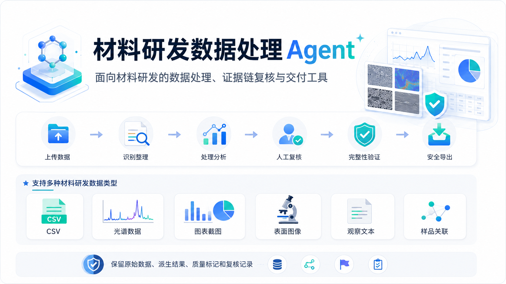
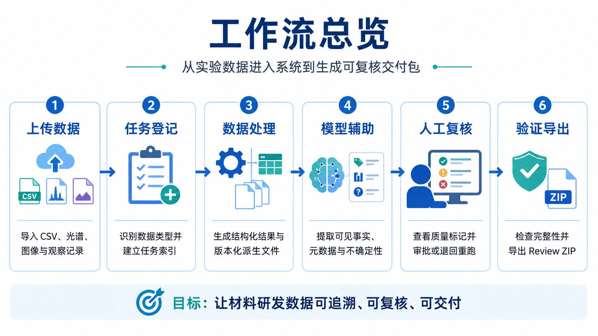
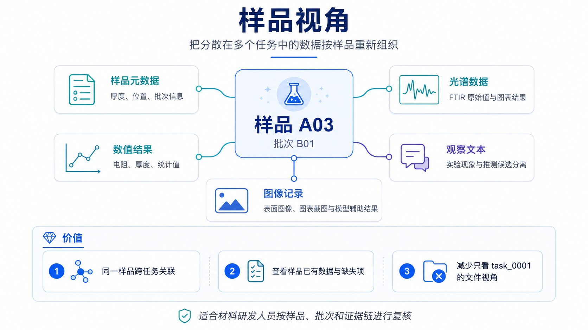
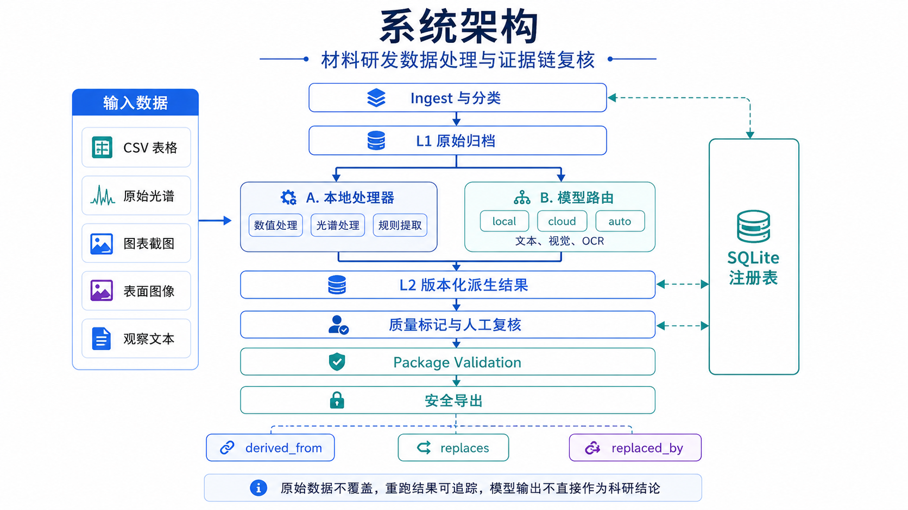
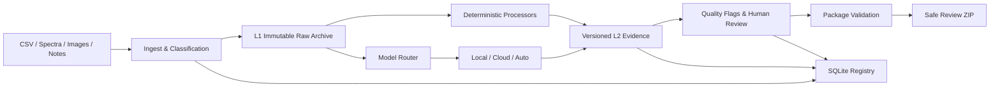

# Material R&D Data Processing Agent

面向材料研发的数据处理、证据链复核与交付系统。

将 CSV、原始光谱、图表截图、表面图像、样品元数据与实验观察记录组织为可追溯的 evidence package，保留原始数据、处理版本、模型辅助结果、质量风险和人工复核记录。

> 模型输出仅用于辅助提取可见事实、元数据与不确定性，不构成科研结论、机理解释或实验建议。



```text
Upload → Ingest → Process → Model Assist → Review → Validate → Export
```

## 项目定位

材料研发数据天然具有多源、异构和强上下文依赖的特征。同一实验对象可能同时对应仪器导出的原始数值、光谱曲线、图表截图、显微或表面图像、观察文本和样品批次信息。若这些内容只按文件存放，处理结果很容易脱离来源，重跑覆盖历史版本，模型生成内容也难以区分事实、推测和待确认信息。

本项目将数据处理组织为一条可审计工作流：原始输入进入不可变归档；确定性处理器与模型路由生成版本化派生结果；质量标记和人工复核记录判断结果是否具备交付条件；validation 在导出前检查对象、文件、run 与关系的一致性；最终生成可复核的 Review ZIP。

核心目标不是替代科研判断，而是提高研发数据的可追溯性、可复核性与可交付性。

## 研究数据工作流



| 阶段 | 系统行为 | 形成的证据 |
|---|---|---|
| Upload / Ingest | 识别数据类型、计算 checksum、登记来源并建立任务 | L0 输入登记、L1 原始归档、manifest |
| Process | 运行数值、光谱、图像或文本处理器 | 独立 processing run、版本化 L2 文件 |
| Model Assist | 按数据类型和 provider capability 路由文本、视觉与 OCR 服务 | 结构化 model result、token/latency、失败 attempt |
| Review | 汇总不确定性、质量标记与模型边界，支持批准、退回和重跑 | quality flags、review records、替代关系 |
| Validate | 交叉检查文件、对象、run、关系与持久化结果 | validation result 与可读报告 |
| Export | 从受控任务目录构建交付包并执行路径安全检查 | Review ZIP 与审阅说明 |

## 一个完整的材料数据案例

一个样品或批次可以跨多个任务进入系统。例如，样品 `A03` 同时拥有 FTIR 原始 CSV、图表截图、表面照片、样品元数据和实验观察文本。

| 输入 | 处理与辅助提取 | 输出 |
|---|---|---|
| FTIR 原始 CSV | 列识别、数值校验、光谱元数据提取 | 原始归档、结构化光谱结果、处理 run |
| FTIR 图表截图 | 图表类型、坐标轴、单位、图例与可见结构提取 | Vision/OCR 结果、置信度、待复核项 |
| 表面图像 | 可见对象、纹理、标注和比例尺文本提取 | 图像观察结果与质量标记 |
| 样品元数据 | 样品编号、批次、位置等字段整理 | 样品索引与跨任务关联 |
| 观察文本 | 事实、趋势描述、推测候选和操作备注分离 | 结构化观察结果，不生成科研结论 |

最终 evidence package 同时包含原始数据、每次运行产生的派生结果、模型辅助记录、质量风险、人工复核、validation 报告和安全导出的 ZIP，而不是只保留一份最终结果文件。

## 核心设计决策

### 原始数据不可变，派生结果版本化

L1 原始归档不被处理器修改。每次处理和模型调用都生成新的 L2 文件与 processing run；重跑通过 `replaces` / `replaced_by` 建立版本关系，不覆盖旧结果。这样可以重建“某个结果由哪份输入、哪次运行和哪套参数产生”。

### 事实、解释与不确定性分层

观察文本中的可见事实、趋势描述、解释候选和操作备注分别存储。模型 schema 禁止科研结论、机理解释与实验建议等字段进入结果，并对禁止字段进行递归清理。模型辅助结果必须保留 confidence、uncertainties 和 requires-review 语义。

### 失败是一级证据

`cloud` 模式不自动降级；失败调用以失败状态持久化。`auto` 模式允许 fallback，但云端失败 attempt 与本地 fallback 拥有独立结果文件和 run ID。后续成功不会覆盖、删除或伪装先前失败。

### 人工复核是工作流状态

低置信度、解析失败、输出截断、输入截断、模型不可用和 fallback 都会进入质量标记。复核动作、复核人、意见和状态独立记录，支持批准、退回和重新处理。

### 文件证据与注册表双轨记录

任务目录保存可移植的 evidence package；SQLite 注册表负责跨任务查询、样品索引、run 与关系审计。validation 交叉检查二者是否一致，避免“文件存在但注册表缺失”或“数据库成功但结果文件丢失”。

### Validation 与 Export 分离

生成 ZIP 不等于证据完整。validation 负责对象身份、路径、run、关系和报告一致性；export 负责 symlink、路径穿越、归档成员与持久化身份安全。任一关键门禁失败，交付状态都不能标记为完成。

## 样品视角

任务目录适合追踪一次处理，但研发复核通常围绕样品和批次展开。Sample View 使用显式 `sample_id`、结构化元数据和受控候选提取，将分散在多个任务中的数值、光谱、图像和观察记录重新组织到样品维度。



- 汇总同一样品跨任务的已有证据；
- 识别缺失的数据类型和待复核项；
- 同时查看原始值、图表结果、图像记录和观察文本；
- 减少只能按任务编号逐文件浏览的割裂视角。

系统不会在样品编号不明确时强行建立关联；不可信候选会保留 warning，并等待人工确认。

## 系统架构





| 模块 | 作用 |
|---|---|
| Ingest | 文件识别、checksum、L0→L1 归档和任务登记 |
| Typed Processors | 数值、光谱、图表、表面图像、观察文本与元数据处理 |
| Model Router | 根据数据类型、运行模式和 provider capability 选择模型角色 |
| Evidence Orchestrator | 持久化 model result、processing run、quality flag 与 relationships |
| Review UI | Basic / Advanced 证据查看、人工复核、重跑、验证和导出 |
| Validation / Export | 包完整性、关系一致性、路径安全和交付包生成 |
| SQLite Registry | 跨任务检索、样品索引及对象/run/关系审计 |

```text
task_XXXX/
├── raw/                 # L1 原始归档副本
├── derived/             # 带 run 前缀的 L2 结果
├── logs/                # runs、flags、relationships、validation
├── reviews/             # 人工复核记录
└── manifest.json        # package 索引
```

## 数据生命周期与关系模型

| 层级 | 含义 | 约束 |
|---|---|---|
| L0 | 外部输入登记 | 记录来源、文件身份和 checksum |
| L1 | 工作区原始归档 | 不修改、不覆盖，作为后续证据根节点 |
| L2 | 派生结果 | 每次运行创建新对象和独立文件 |
| L3 | 失败、废弃或被替代状态 | 保留历史状态，不物理删除证据 |

系统使用三类显式关系维护证据链：

- `derived_from`：派生对象与输入对象、处理 run 的来源关系；
- `replaces`：新结果替代同 subtype 的旧结果；
- `replaced_by`：旧结果指向后继版本。

## Agent 与模型服务层

模型不是独立聊天入口，而是受数据类型、角色 schema 和审计策略约束的辅助处理节点。

### 路由模式

| 模式 | 网络行为 | 失败语义 |
|---|---|---|
| `local` | 零网络调用，使用确定性处理器和本地规则 | 不依赖 API key，可离线复现 |
| `cloud` | 调用已配置 provider | 失败即失败，不自动 fallback |
| `auto` | 优先调用云端，失败后执行本地 fallback | 同时保留失败 attempt 与 fallback evidence |

### 已验证的模型角色

| 能力 | Provider / Model | 结构化边界 | 状态 |
|---|---|---|---|
| 观察文本结构化 | DeepSeek `deepseek-v4-pro` | 事实、趋势、推测候选、操作备注、样品与时间表达 | 已真实验证 |
| 图表与表面图像理解 | Xiaomi MiMo `mimo-v2.5` | 图表类型、轴、单位、图例、可见结构或表面特征 | 已真实验证 |
| OCR | SiliconFlow `PaddlePaddle/PaddleOCR-VL-1.5` | 文本块、单位、坐标候选、不可读区域 | 已真实验证 |
| 自动降级 | Cloud failure → local fallback | 失败与降级结果分别持久化 | 已验证 |

请求正文、图片 MIME、endpoint 拼接、JSON mode 和 token 上限由 provider profile 控制。响应需要经过分层 JSON 解析、角色级 Pydantic schema 校验、禁止字段清理与统一脱敏，才能进入 evidence package。

详细真实调用证据见 [REAL_API_CHECK.md](REAL_API_CHECK.md)，当前发布状态见 [CURRENT_RELEASE_STATUS.md](CURRENT_RELEASE_STATUS.md)。

## 操作界面

Streamlit UI 提供七个工作区入口：

- **Overview**：任务、run、quality flag、review 与 model-result 汇总；
- **Ingest**：目录导入与文件上传；
- **Tasks**：任务筛选和状态查看；
- **Task Detail**：Basic / Advanced 证据视图、处理、复核、validation 与 export；
- **Sample View**：样品级跨任务关联与缺失项检查；
- **Model Profiles**：仅显示 provider 配置状态和非敏感 capability；
- **Help**：数据契约、工作流与复核说明。

系统同时提供 Marimo 复核入口，用于针对单个任务打开交互式数据工作台。

## 快速体验

### 安装

要求 Python 3.10+，支持 macOS、Linux 或具备 Python / SQLite 的等价环境。

```bash
python3.11 -m venv .venv
.venv/bin/python -m pip install --upgrade pip
.venv/bin/python -m pip install -e '.[dev]'
```

### 启动本地 UI

```bash
mkdir -p workspace
.venv/bin/python -m data_agent ui --workspace ./workspace
```

### 运行完整 CLI 流程

```bash
export DATA_AGENT_DEMO_INBOX=/path/to/demo-inbox
export WORKSPACE=/tmp/material-agent-workspace

.venv/bin/python -m data_agent ingest --inbox "$DATA_AGENT_DEMO_INBOX" --workspace "$WORKSPACE"
.venv/bin/python -m data_agent process --workspace "$WORKSPACE" --all --models local
.venv/bin/python -m data_agent review --workspace "$WORKSPACE" --task task_0001 \
  --action approve --reviewer reviewer-id --comment "Reviewed against source evidence"
.venv/bin/python -m data_agent validate --workspace "$WORKSPACE" --all
.venv/bin/python -m data_agent export --workspace "$WORKSPACE" --task task_0001
```

输入命名、CSV 字段和图片约束见 [Data Input Contract](docs/data_input_contract.md)；完整界面流程见 [UI Walkthrough](docs/ui_walkthrough.md)。

### 配置可选云端模型

```bash
cp .env.example .env
cp model_profiles.yaml.example model_profiles.yaml

set -a
source .env
set +a

.venv/bin/python -m data_agent models check --verbose
```

`.env` 与真实 `model_profiles.yaml` 已被 Git 忽略。Runner 不接受命令行 key 参数，local 模式不读取云端 payload，也不会发起网络请求。

## 工程质量与发布证据

| 门禁 | 当前状态 |
|---|---|
| GitHub Actions 离线 CI | PASS |
| 默认 pytest | `263 passed, 52 skipped` |
| Python compile check | PASS |
| `git diff --check` | PASS |
| DeepSeek / MiMo / SiliconFlow 合成真实 smoke | PASS |
| Auto fallback 审计 | PASS |
| Repository / SQLite / reports / ZIP 精确密钥扫描 | PASS |
| Evidence package validation / export | PASS 或有解释的 review WARN |

52 个 skip 是未设置 `DATA_AGENT_DEMO_INBOX` 时的外部 demo 集成测试，不代表对应流程失败，也不被记录为已执行。真实模型 smoke 使用临时目录中的合成、脱敏输入，不发送真实研发数据。

```bash
env -u DATA_AGENT_DEMO_INBOX .venv/bin/python -m pytest -q
.venv/bin/python -m compileall -q data_agent scripts
git diff --check
```

## 当前边界

- 当前为本地优先、单用户 Streamlit 应用，尚未引入多租户权限模型；
- 处理流程以同步执行为主，尚无异步任务队列和分布式 worker；
- 已覆盖通用 CSV、文本、图片与光谱输入，但尚未适配复杂仪器专有二进制格式；
- Sample Index 依赖显式 `sample_id`、结构化元数据或可解释的可信候选；
- 图像与 OCR 结果属于辅助观察，近似判断和不可读区域需要人工确认；
- 模型结果不会自动生成科研结论、机理解释或实验建议；
- validation 验证证据包内部一致性，不替代领域专家对实验合理性的判断。

这些约束用于明确系统的证据边界：自动化负责整理、追踪、提示和交付，科研判断仍由具备上下文的研究人员完成。

## 项目结构

```text
data_agent/
├── model_adapters/     # provider profile、请求、解析、schema、fallback、脱敏
├── processors/         # 各数据类型的确定性处理器
├── ui/                 # Streamlit 操作与复核界面
├── ingest.py           # 输入登记和 L0→L1 归档
├── process.py          # 统一处理、模型调用和 evidence 编排
├── validation.py       # package 完整性与关系验证
├── export.py           # validation-aware 安全 ZIP 导出
├── sample_index.py     # workspace 样品索引
└── schemas.py          # 生命周期和审计对象
marimo_apps/            # 交互式复核工作台
scripts/                # 真实 API smoke 与安全扫描
tests/                  # 离线单元、集成、安全和 UI 测试
docs/                   # 数据契约、模型层、UI 与真实调用文档
```

## 文档与状态

- [Current Release Status](CURRENT_RELEASE_STATUS.md)：当前版本的唯一发布状态入口；
- [Real API Check](REAL_API_CHECK.md)：真实 provider 调用与安全验证证据；
- [Model Integration Audit](docs/real_model_integration_audit.md)：模型路由、输入、解析和持久化链路；
- [Data Input Contract](docs/data_input_contract.md)：支持的数据类型、字段和命名约束；
- [UI Walkthrough](docs/ui_walkthrough.md)：界面操作与复核流程；
- `FINAL_CHECK.md`、`MODEL_LAYER_CHECK.md`、`FRONTEND_CHECK.md`：保留原始数字的历史 checkpoint。

## License

本项目采用 MIT License，详见 [LICENSE](LICENSE)。
