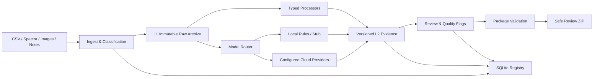

# Material R&D Data Processing Agent

面向材料研发数据整理、证据链复核与交付的本地优先数据处理 Agent。系统将分散的 CSV、光谱数据、图表截图、表面图像和实验观察文本组织为可追溯的 evidence package，并提供版本化处理、人工复核、完整性验证和安全导出。

> 模型输出仅用于辅助提取可见事实、元数据和不确定性，不构成科研结论、机理解释或实验建议。

## 项目概览

材料研发数据通常同时包含结构化表格、仪器导出、图片和自然语言记录。仅生成处理结果并不足以支持后续复核：还需要知道输入来自哪里、使用了什么处理步骤、哪些结果被替代、哪些内容需要人工确认，以及交付包是否完整。

本项目围绕这条证据链实现完整工作流：

```text
Upload → Ingest → Process → Review → Validate → Export
```

核心能力：

- 多类型研发数据识别与统一任务登记
- L0–L3 生命周期管理和不可变原始数据归档
- 每次运行生成独立 L2 结果，重跑不覆盖历史产物
- `derived_from`、`replaces`、`replaced_by` 关系追踪
- local / cloud / auto 三种模型模式和可审计 fallback
- SQLite 注册表与任务目录 evidence package 双重记录
- Streamlit 操作界面与 Marimo 复核工作台
- package validation、安全 ZIP 导出和样品级索引
- API key、异常信息、模型原始响应和 UI 展示统一脱敏

## 系统架构



任务目录保留可移植的文件证据，SQLite 负责跨任务查询和关系审计：

```text
task_XXXX/
├── raw/                 # L1 原始归档副本
├── derived/             # 带 run 前缀的 L2 结果
├── logs/                # runs、flags、relationships、validation
├── reviews/             # 人工复核记录
└── manifest.json        # package 索引
```

## 数据与审计模型

### 生命周期

| 层级 | 含义 | 约束 |
|---|---|---|
| L0 | 外部输入登记 | 记录来源和 checksum |
| L1 | 工作区原始归档 | 不修改、不覆盖 |
| L2 | 派生结果 | 每次运行创建新文件和对象 |
| L3 | 废弃、失败或被替代状态 | 保留历史，不物理删除证据 |

### 模型调用

| 数据类型 | local | cloud / auto |
|---|---|---|
| 样品元数据、数值、原始光谱 | 本地确定性处理 | 本地确定性处理 |
| 图表截图 | local stub | OCR + Vision |
| 表面图像 | local vision stub | Vision + OCR |
| 观察文本 | 本地规则结果 | Text extraction |

`cloud` 记录云端调用的真实成功或失败；`auto` 在云端失败时执行本地 fallback，并分别保留云端失败 attempt 和最终 fallback evidence。失败记录不会被 fallback 覆盖或伪装为云端成功。

当前 provider profile 模板对应：

- DeepSeek `deepseek-v4-pro`：观察文本结构化提取
- Xiaomi MiMo `mimo-v2.5`：图表和表面图像观察
- SiliconFlow `PaddlePaddle/PaddleOCR-VL-1.5`：图片文字提取

真实 provider 验证状态以 [CURRENT_RELEASE_STATUS.md](CURRENT_RELEASE_STATUS.md) 和 [REAL_API_CHECK.md](REAL_API_CHECK.md) 为准。没有真实调用证据时统一标记为 `NOT RUN`。

## 快速开始

### 环境

- Python 3.10+
- macOS、Linux，或支持 Python/SQLite 的等价环境

```bash
python3.11 -m venv .venv
.venv/bin/python -m pip install --upgrade pip
.venv/bin/python -m pip install -e '.[dev]'
```

### 本地工作流

```bash
export DATA_AGENT_DEMO_INBOX=/path/to/demo-inbox
export WORKSPACE=/tmp/material-agent-workspace

.venv/bin/python -m data_agent ingest \
  --inbox "$DATA_AGENT_DEMO_INBOX" \
  --workspace "$WORKSPACE"

.venv/bin/python -m data_agent process \
  --workspace "$WORKSPACE" \
  --all \
  --models local

.venv/bin/python -m data_agent info --workspace "$WORKSPACE"

.venv/bin/python -m data_agent review \
  --workspace "$WORKSPACE" \
  --task task_0001 \
  --action approve \
  --reviewer reviewer-id \
  --comment "Reviewed against source evidence"

.venv/bin/python -m data_agent validate \
  --workspace "$WORKSPACE" \
  --all

.venv/bin/python -m data_agent export \
  --workspace "$WORKSPACE" \
  --task task_0001
```

输入文件命名、CSV 字段和图片要求见 [Data Input Contract](docs/data_input_contract.md)。

## 本地 UI 与复核工具

启动七个 tab 的 Streamlit 界面：

```bash
.venv/bin/python -m data_agent ui --workspace "$WORKSPACE"
```

界面包括：

- Overview：任务、run、flag、review 和 model-result 汇总
- Ingest：目录导入与文件上传
- Tasks：任务筛选和状态查看
- Task Detail：Basic / Advanced evidence 视图、处理、复核、验证与导出
- Sample View：样品与任务的保守关联索引
- Model Profiles：仅显示配置状态，不显示密钥值
- Help：工作流、数据契约和复核入口

生成 Marimo 复核命令：

```bash
.venv/bin/python -m data_agent open \
  --workspace "$WORKSPACE" \
  --task task_0001 \
  --print-command
```

完整操作流程见 [UI Walkthrough](docs/ui_walkthrough.md)。

## 云端模型配置

云端模型是可选增强；local 模式不依赖网络或 API key。

```bash
cp .env.example .env
cp model_profiles.yaml.example model_profiles.yaml
```

`.env` 和 `model_profiles.yaml` 已被 Git 忽略。真实密钥只应通过本机环境变量或本地 secret manager 提供，不能写入源码、测试、报告、SQLite、截图或提交记录。

```bash
set -a
source .env
set +a

.venv/bin/python -m data_agent models check --verbose
```

执行合成输入的 provider smoke test：

```bash
.venv/bin/python scripts/run_real_api_check.py --scenario deepseek-text
.venv/bin/python scripts/run_real_api_check.py --scenario mimo-vision
.venv/bin/python scripts/run_real_api_check.py --scenario siliconflow-ocr
.venv/bin/python scripts/run_real_api_check.py --scenario auto-fallback
```

Runner 不接受命令行 key 参数；缺少环境变量时安全返回 `SKIPPED`。安全操作说明见 [Real API Check Template](docs/real_api_check_template.md)。

## 验证与安全门禁

默认测试完全离线：

```bash
env -u DATA_AGENT_DEMO_INBOX .venv/bin/python -m pytest -q
.venv/bin/python -m compileall -q data_agent scripts
git diff --check
```

当前离线基线：`263 passed, 52 skipped`。52 个 skip 为未配置 `DATA_AGENT_DEMO_INBOX` 时的 demo 集成测试，不代表真实 demo 流程已经在当前环境执行。

真实调用后，对仓库、workspace、SQLite 和 ZIP 执行精确密钥扫描：

```bash
.venv/bin/python scripts/audit_secret_leaks.py \
  --repo . \
  --workspace "$SMOKE_WORKSPACE" \
  --zip "$EXPORTED_ZIP"
```

任何真实密钥进入 Git、workspace、报告、SQLite 或 ZIP 都属于发布阻塞问题。

## 关键工程约束

- 原始文件和旧 L2 结果不可覆盖
- validation 不静默修复业务数据
- export 不把 ZIP 生成等同于 validation 通过
- symlink、路径穿越和不安全归档成员会被拒绝
- 模型输出经过角色级 schema 校验和递归禁止字段清理
- `reasoning_content` 不作为最终模型输出
- 低置信度、解析失败、截断和 fallback 必须进入人工复核流程
- UI、Markdown、JSON、异常和导出内容使用统一脱敏规则

## 项目结构

```text
data_agent/
├── model_adapters/     # provider profiles、请求、解析、schema、fallback、脱敏
├── processors/         # 各数据类型的确定性处理器
├── ui/                 # Streamlit 操作与复核界面
├── ingest.py           # 输入登记和 L0→L1 归档
├── process.py          # 统一处理、模型调用和 evidence 编排
├── validation.py       # package 完整性与关系验证
├── export.py           # validation-aware 安全 ZIP 导出
├── sample_index.py     # workspace 样品索引
└── schemas.py          # 生命周期和审计对象
marimo_apps/            # 交互式复核工作台
scripts/                # 真实 API smoke 与安全扫描
tests/                  # 离线单元、集成、安全和 UI 测试
docs/                   # 数据契约、模型层、UI 与真实调用文档
```

## 状态与文档

- [Current Release Status](CURRENT_RELEASE_STATUS.md)：唯一当前发布状态入口
- [Real API Check](REAL_API_CHECK.md)：真实 provider 调用证据
- [Model Integration Audit](docs/real_model_integration_audit.md)：路由和审计链
- [Data Input Contract](docs/data_input_contract.md)：输入数据规范
- [UI Walkthrough](docs/ui_walkthrough.md)：界面操作流程
- `FINAL_CHECK.md`、`MODEL_LAYER_CHECK.md`、`FRONTEND_CHECK.md`：历史 checkpoint

## License

本项目采用 MIT License，详见 [LICENSE](LICENSE)。
