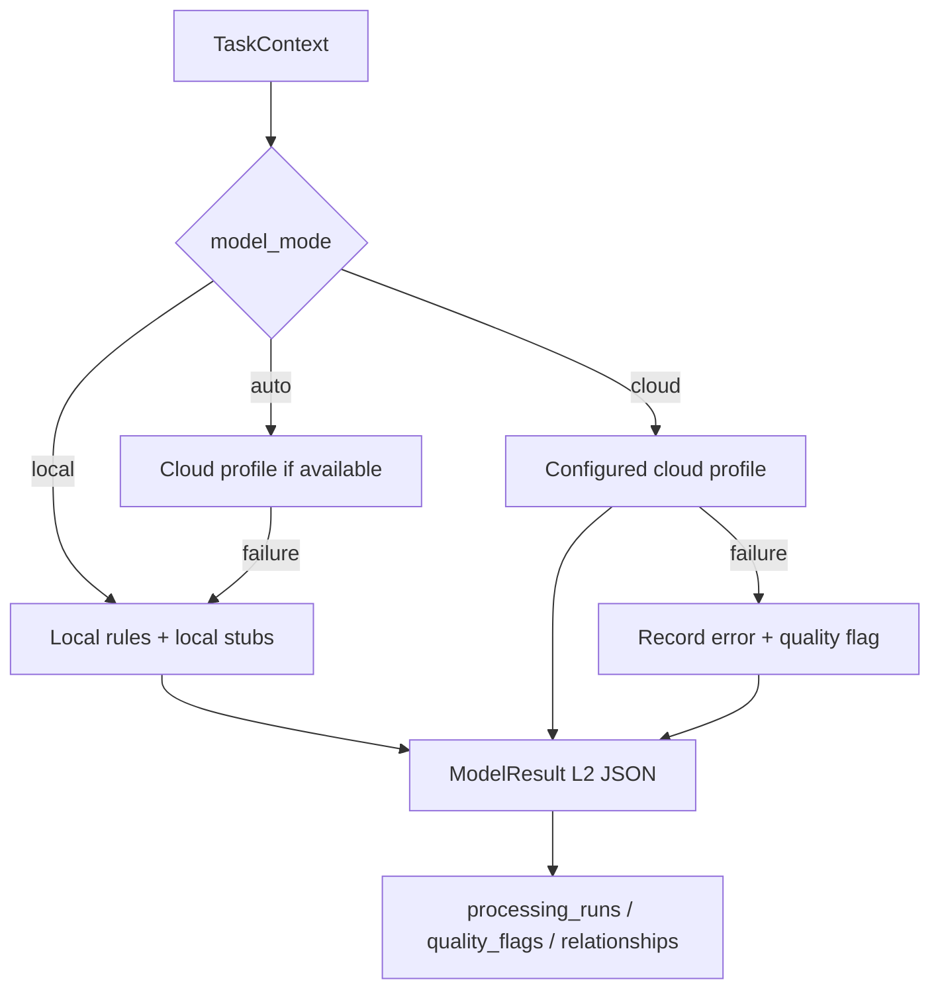

# Model Service Layer

## 概述

Model Service Layer 为材料研发数据处理 Agent 提供可配置的模型服务层，支持本地 stub、云端 API 调用和自动降级。

## 模型角色

| 角色   | 用途 | 支持 Vision | 典型模型 |
|--------|------|-------------|----------|
| `fast` | 文本结构化提取（低延迟） | 否 | gpt-4o-mini, deepseek-chat |
| `best` | 高质量文本分析（高精度） | 否 | gpt-4o, claude-3-opus |
| `vision` | 图像内容分析和特征提取 | 是 | gpt-4o, claude-3-vision |
| `ocr` | 图表/图像中文字提取 | 是 | gpt-4o, claude-3-vision |

## Provider 类型

### openai_compatible

标准文本模型接口，通过 `POST /chat/completions` 调用，要求返回 JSON。
- 超时：45-90s（可配置）
- Temperature：0.0（确定性输出）

### openai_compatible_vision

多模态模型接口，支持图像输入（base64 编码）。使用 `image_url` 格式发送图像。

## Router 规则

路由表定义了每种数据类型在不同模式下的模型角色分配：

```
sample_metadata:          无模型
raw_numeric:             无模型
raw_spectral:            无模型
chart_image_input:       OCR + Vision
visual_image:            Vision + OCR
descriptive_observation_text: Fast
structured_observation:  无模型
```

## Mode 行为

### local

- 不调用任何云端模型
- 使用 local_stub / local_ocr_stub / local_vision_stub
- 零网络请求

### cloud

- 尝试调用已配置的云端 profile
- 失败时记录 error 和 quality_flag，主流程不崩溃
- 不启用 fallback

### auto

- 优先使用云端 profile
- 缺失 profile、缺失 env、超时、无效 JSON 时自动 fallback
- Fallback 链：ocr → local_ocr_stub → local_stub；vision → local_stub；fast → local_stub
- 记录 `fallback_used` 和实际使用的 provider/model

## ModelResult Schema

每次模型调用返回标准化的 `ModelResult`：

```python
{
    "success": bool,
    "role": "ocr",
    "provider": "openai_compatible_vision",
    "model": "gpt-4o",
    "mode": "auto",
    "input_type": "image",
    "output_json": {...},
    "raw_text": "...",
    "raw_response": {...},  # 已脱敏
    "confidence": 0.0-1.0,
    "warnings": [...],
    "error": "",
    "fallback_used": false,
    "fallback_from": "",
    "latency_ms": 1234,
    "token_usage": {"prompt_tokens": 100, "completion_tokens": 50, "total_tokens": 150},
    "created_at": "2024-01-01T00:00:00+00:00",
    "schema_version": "model_result_v1",
    "prompt_version": "v1"
}
```

## Quality Flag 行为

模型调用过程中可能产生以下质量标记：

```
model_unavailable          模型未配置或调用失败
fallback_used              使用了降级方案
low_confidence_model_output 模型置信度 < 0.5
model_json_invalid         模型返回了无效 JSON
schema_validation_failed   输出 schema 验证失败
ocr_unavailable            OCR 不可用
axis_confirmation_required 图表轴线需要人工确认
image_observation_requires_review 图像观察需要人工复核
interpretation_candidate_detected 检测到解释性候选句
model_output_excluded_from_conclusion 禁止字段被移除
requires_human_review      需要人工复核
```

## 安全与脱敏规则

- API Key 从不写入 SQLite、JSON、Markdown 或 CLI 输出
- Authorization header 不持久化
- 完整 request body 不持久化（如包含敏感值）
- raw_response 保存前进行脱敏（Authorization、api_key 等字段替换为 `[REDACTED]`）
- 禁止输出字段自动移除：`final_conclusion`、`mechanism_explanation`、`experiment_recommendation`

## 证据包要求

每次模型调用产生：

1. **L2 JSON 文件**：`derived/run_<short>__model_result_<role>.json`
2. **DataObject**：`data_type = model_result`，`lifecycle = L2`
3. **ProcessingRun**：`tool_name = "model:<role>"`
4. **Relationship**：`L1 input → model_result L2 (derived_from)`

Rerun 时：旧 L2 保留，新 L2 创建 `replaces`/`replaced_by` 关系。

## Routing Diagram


